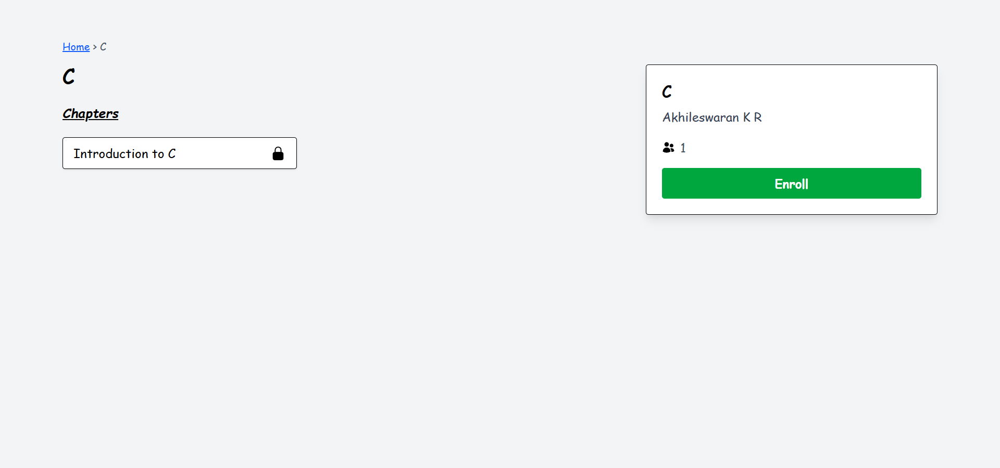

# 📚 Learning-Management-System

A lightweight Learning Management System built with **Node.js**, **Express**, **EJS**, **Sequelize**, and **Tailwind CSS**. It supports user authentication, course creation, page navigation, progress tracking, and admin reporting.

---

## 🚀 Features

- 🧑‍🎓 Student and Admin roles
- 📘 Course and Chapter Management
- 📄 Page creation and viewing with progress tracking
- ✅ "Mark as Complete" tracking with visual progress bars
- 📊 Admin reports with enrollment and completion stats
- 🔐 CSRF Protection and session handling

---

## 📸 Screenshots

### Student View – Course Page  

### Page View with Progress  

### Admin Report  

---

## 🛠️ Technologies Used

- **Backend**: Node.js, Express, Sequelize ORM (PostgreSQL)
- **Frontend**: EJS templates + Tailwind CSS
- **Authentication**: Session-based login with CSRF protection
- **Database**: PostgreSQL

---

# 🌐 Live Demo

Try the app live here:  
👉   
(*Feel free to sign up and explore!*)

---

# 🎥 Screencast Walkthrough

Watch a short demo of how the LMS works and how you can use it:  
📺   
(*Covers registration, course creation, navigating pages, and progress tracking.*)

---
